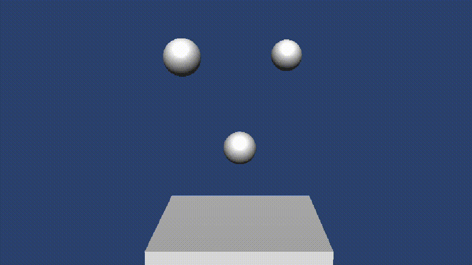

<!--                        _____      _ _  __                                      >
<                          / ____|    | | |/ /                                      >
<    ___  _ __   ___ _ __ | |  __     | | ' /                                       >
<   / _ \| '_ \ / _ \ '_ \| | |_ |_   | |  <                                        >
<  | (_) | |_) |  __/ | | | |__| | |__| | . \                                       >
<   \___/| .__/ \___|_| |_|\_____|\____/|_|\_\                                      >
<        | |                                                                        >
<        |_|                                                                        >
<                                                                                   >
< Copyright 2023 Mattia Montanari                                                   >
<                                                                                   >
< This program is free software: you can redistribute it and/or modify it under     >
< the terms of the GNU General Public License as published by the Free Software     >
< Foundation, either version 3 of the License. You should have received a copy      >
< of the GNU General Public License along with this program. If not, visit          >
<                                                                                   >
<     https://www.gnu.org/licenses/                                                 >
<                                                                                   >
< This program is distributed in the hope that it will be useful, but WITHOUT       >
< ANY WARRANTY; without even the implied warranty of MERCHANTABILITY or FITNESS     >
< FOR A PARTICULAR PURPOSE. See GNU General Public License for details.           -->

# Unity Plug-in for OpenGJK

This repository presents a mini-app where the game engine Unity invokes the [OpenGJK library](https://www.mattiamontanari.com/opengjk/) to compute the minimum distance between 3D objects. The aim is to provide a simple reference for using OpenGJK as plug-in for in Unity projects.
A simple Unity project is provided and is neither fast nor elegant, but I hope it does the job.

A pipeline testing the link between new versions of OpenGJK and Unity is currently under development. In the meantime you can launch the tests manually either in the Unity Editor via command line:

``` sh
Unity.exe -batchmode -logFile log_fromContainer.log -projectPath unity_basic -runTests -testPlatform playmode -testResults test_results_2.xml
```
<!-- /Applications/Unity/Hub/Editor/2022.2.13f1/Unity.app/Contents/MacOS/Unity -batchmode -logFile log_fromContainer.log -projectPath unity_basic -runTests -testPlatform playmode -testResults test_results_2.xml -->

Finally, Remember that the Gilbert-Johnson-Keerthi (GJK) algorithm returns the distance between two convex objects. Should be objects be concave, OpenGJK returns the minimum distance between their convex hulls.

## Sample scenes

The sample scenes that aim to demonstrate how to call OpenGJK in your project. It is quite unlikely that the scripts provided here will fit every single project in need for a GJK implementation, however these scripts are trivial to understand. Use them to learn and rewrite your own to suit your project.



In the example above the spheres are rigid, but bounce up thanks to a force applied upward. This magnitude of this force is proportional to the distance, computed with openGJK, between the plan and each sphere.

## Get started

Unity uses the C# interface provided by OpenGJK to call the function that computes the distance. This means that OpenGJK must to be compiled on your system and placed somewhere so that Unity can load it.

The key steps are:

 1. Clone this repository - including the OpenGJK submodule!
 2. Build OpenGJK as shared library.
 3. Find a way to make the OpenGJK shared library accessible to Unity. This really depends on the project you are working on and there are many solutions. For example: (1) copy the shared library to ./Assets/Plugins manually or with a script, (2) add to `PATH` the directory where the shared library resides, (3) install the OpenGJK library.
 4. Launch Unity and play one of the sample scenes described earlier.

> Actually, can I build directly in the right folder?

These are very standard steps and I cannot document them in details. You need to have some basic understanding on the procedure to proceed. However, if you do not know where to start, start by looking at the pipeline in this repository. If you do get stuck, please open an issue.

### Unity Version

While this mini-app uses 20XX.x.x, much older versions will work with the very same scripts.

# Contribute

You are very welcome to:

- Create pull requests of any kind
- Let me know if you are using this mini-app and find it useful
- Open issues with request for support because they will help you and many others